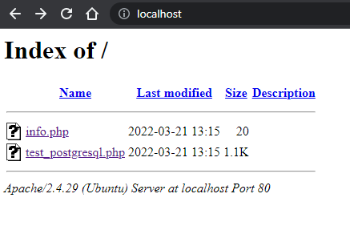
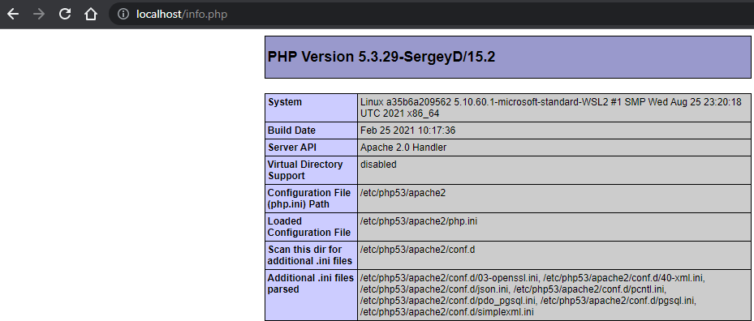
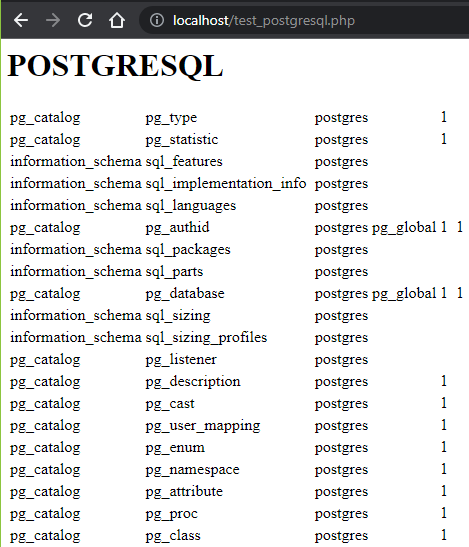
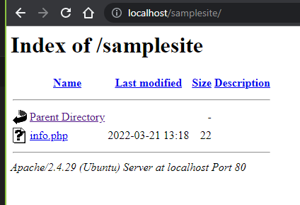
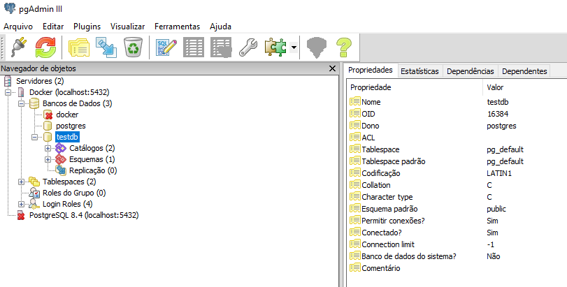

# Docker-Ubuntu18-Apache2-PHP53-Postgresql84
Enviroment for Developer PHP
by difuao@gmail.com

Docker image created in linux Ubuntu 18.04, web server Apache2, PHP 5.3.29 and Postgresql 8.4.

## Image
Create Image.
```
docker image build -t difusao/ubuntu18-apache2-php53-pgsql84 .
```

or `pull` image from repository.
```
docker pull difusao/ubuntu18-apache2-php53-pgsql84
```

## Crete container
Create container daemon mode  `-d`.
Open ports `-p 80:80 -p 5432:5432` (http and postgresql services).
```
docker container run -d -p 80:80 -p 5432:5432 -v 'C:\www\samplesite:/var/www/samplesite' -v 'C:\www\clipboard\:/tmp' --name httpd-php-psql difusao/ubuntu18-apache2-php53-pgsql84
```

## Exec, custom configuration end Scripts in container
```
docker exec -it httpd-php-psql /bin/bash
```

Script for set create database, add user, password and restore dump.
```
sh /tmp/script_postgresql.sh
```
## Screens

Main page.



About info PHP 5.3.29 configurations.



Connectivy test in PostgreSQL.



Page with route Sample Site `http://localhost/samplesite/`.



Connectivy test in PostgreSQL using <a href="https://www.pgadmin.org/" target="_blank">PgAdmin</a>.

